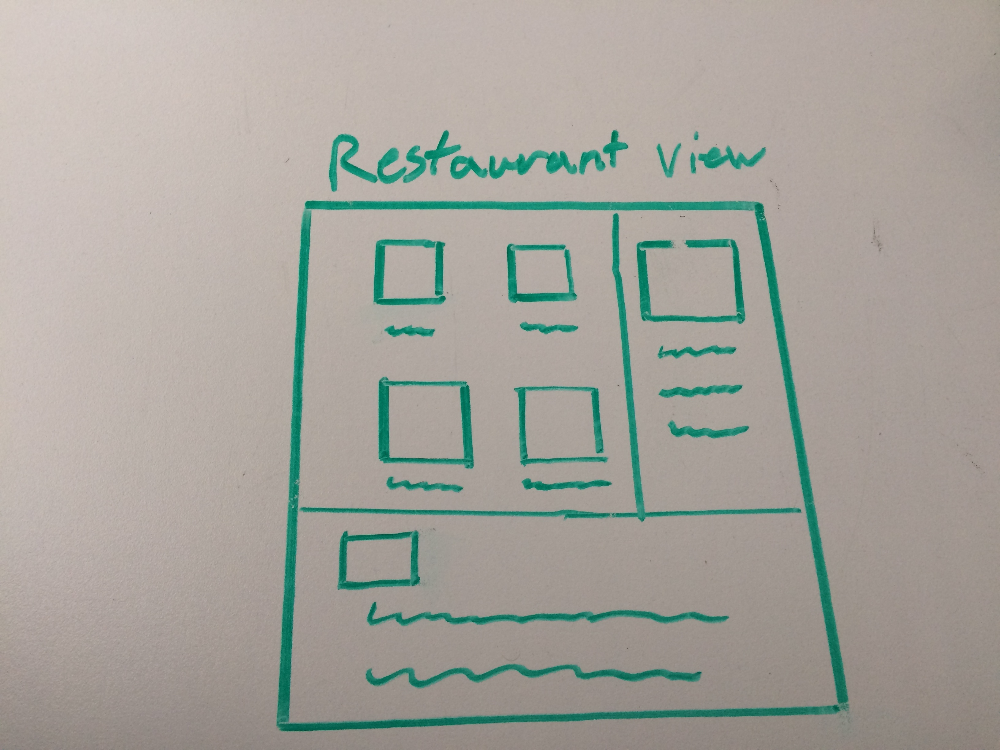
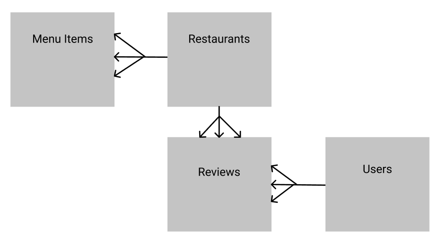

<h1> Overview </h1>
Are you tired of scouring the internet looking for restaurants that have vegan options? 
Are you tired of Scrolling through endless reviews on a website, not knowing if they are genuine? 
 
 
This is Veganelp, a review site for plant-based and vegan friendly restaurants. Restaurants do not pay to have their information on Veganelp. This site was created to allow users to see the restaurants and reviews without worrying about them not being unbiased.
 

[Live site](https://plant-based-app.herokuapp.com/)
 
Technologies Used
React.js, Javascript, Node.JS, Express, Mongoose, HTML5, CSS3,
Design - Bootstrap, React-Bootstrap.
Project Planning & Text Editor - Trello, Figma, Visual Studios Code

WireFrame: 

[Trello:](https://trello.com/b/13WPTHZE/project2)

ERD: 

